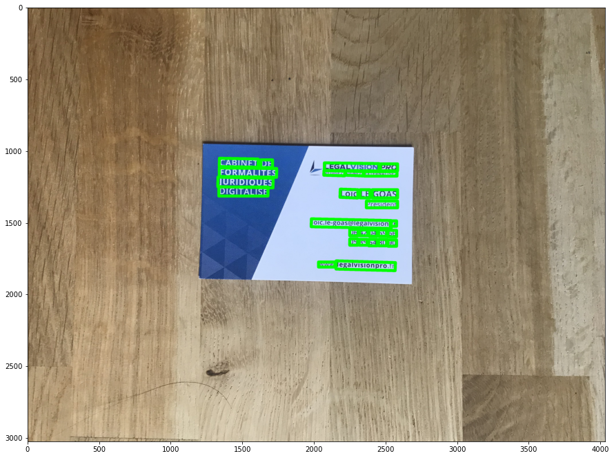
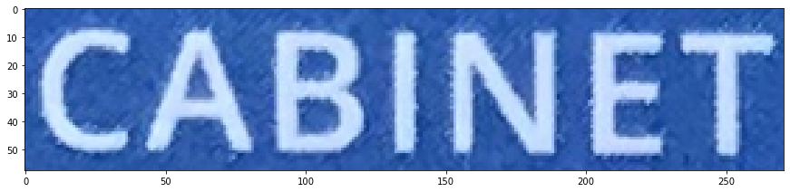
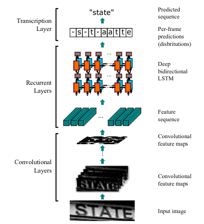
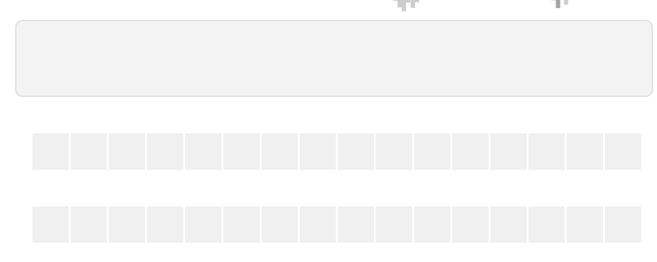
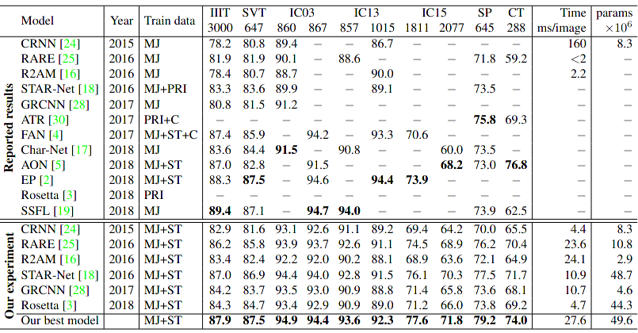
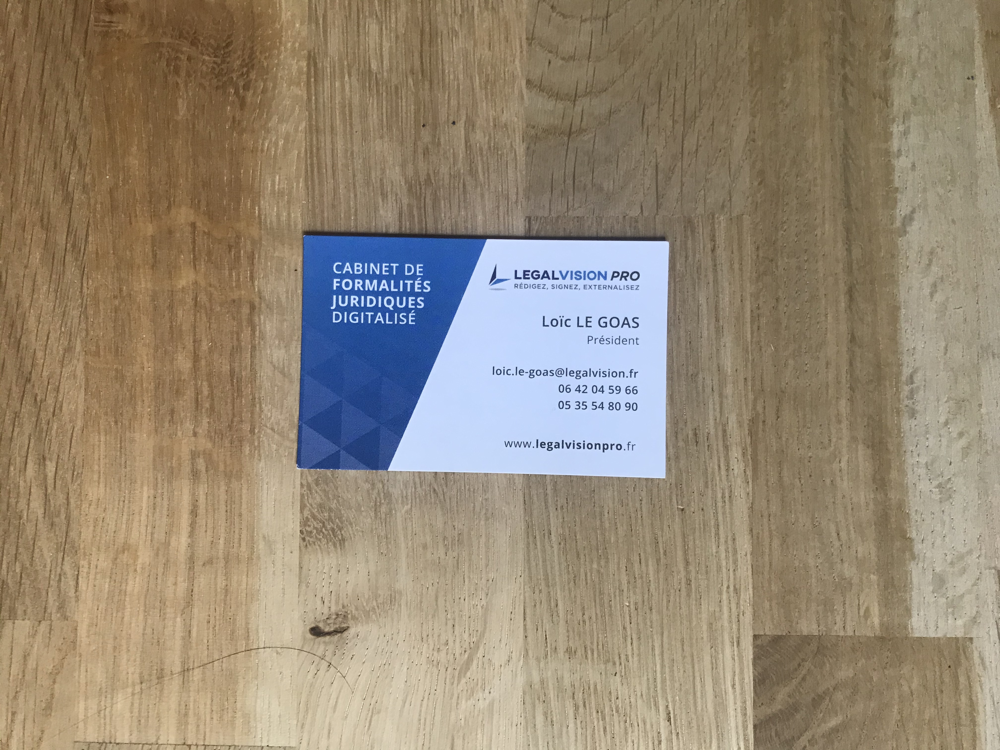

# ETUDIANTS
Ismail El Majdoubi 71602313 MIDS  
Soufiane Rahoui 71605840 MIDS  

---

# OCR in deep learning

L'OCR se decompose en general en trois parties:

1. detection de bounding box contenant du texte faisant office de feature extractor
2. faire une projection de la zone de texte
3. reconnaissance du texte dans la projection

Il est possible, dans une idéologie purement deep learning, de faire l'entrainement de bout en bout sans passer par la detection de bouding box.

Il est egalement possible de faire la partie 1. en utilisant uniquement des methodes sans entrainement, 3. egalement si la police de caractères est connu grâce a une fenêtre coulissante et un preprocessing adequat (thresholding (binaire, otsu, adaptatif), dilatation, erosion).

Pour notre projet nous avons décider d'utiliser le modèle [CRAFT](https://github.com/clovaai/CRAFT-pytorch) ([papier](https://arxiv.org/abs/1904.01941)) pre-entrainé pour la detection de bounding box.

Pour la projection un cropping de la zone d'interêt pourrait suffire.
Nous avons décidé d'utiliser une application projective permettant d'avoir une vu d'aigle sur la zone d'interêt.  
L'application projective, autrement nommée une homographie, est une application projective bijective entre l'espace projectif de l'image vers la zone d'interêt tout en gardant le birapport de 4 points.

Pour la detection de caractère nous avons choisi l'architecture utiliser par [Tesseract](https://github.com/tesseract-ocr/tesseract) et [OpenOCR](https://github.com/tesseract-ocr/tesseract), les deux plus grands OCR open source, le CRNN.
### [CRNN 2015](https://arxiv.org/pdf/1507.05717.pdf)

- La partie convolutionnel est un VGG profond  
- la partie recurrente est un LTSM bi-directionnel terminant avec une couche entièrement connectée  
- la partie transcription est un CTC decodant de manière greedy  

Pour l'entrainement, il n'est pas possible d'utiliser la cross entropy loss car le CRNN renvoie une distribution de probabilité pour chaque vecteur de features et chaque classe de notre alphabet, la CTC loss est donc utilisé.

 <em>CTC</em>

Bien que cette architecture soit ancienne elle s'avère rester toujours très proche de l'etat de l'art tout en gardant un nombre inférieur de parametres et une inference rapide faisant de cette architecture un excellent choix en production.

En effet, ce papier faisant un benchmarking des architectures d'OCR le confirme.
### [What Is Wrong With Scene Text Recognition Model Comparisons? Dataset and Model Analysis 2019](https://arxiv.org/abs/1904.01906)
__MJ = MJSYNTH__

## resultat

LEGALVISION PRO  
RÉDIGEZ, SIGNEZ, EXTERNALISEZ  

CABINET DE     
FORMALITÉS      
JURIDIQUES   
DIGITALISÉ  

Loïc LE GOAS  
Président  

loic.le-goas@legalvision.fr  
06 42 04 59 66  
05 35 54 80 90

WWW legalvisionpro fr

  
  
  
### _sources_

What Is Wrong With Scene Text Recognition Model Comparisons? Dataset and Model Analysis 2019   
https://arxiv.org/abs/1904.01906 

Image Processing Based Scene-Text Detection and Recognition with Tesseract 2020  
https://arxiv.org/abs/2004.08079

CRAFT, Character Region Awareness for Text Detection 2019  
https://arxiv.org/abs/1904.01941

CRNN, An End-to-End Trainable Neural Network for Image-based Sequence Recognition and Its Application to Scene Text Recognition 2015  
https://arxiv.org/abs/1507.05717

CTC, Connectionist Temporal Classification: Labelling UnsegmentedSequence Data with Recurrent Neural Networks 2006  
https://www.cs.toronto.edu/~graves/icml_2006.pdf

Scene Text Detection and Recognition:The Deep Learning Era 2020  
https://arxiv.org/pdf/1811.04256.pdf

https://github.com/clovaai/CRAFT-pytorch  
https://github.com/JaidedAI/EasyOCR  
https://github.com/clovaai/deep-text-recognition-benchmark  
https://github.com/tesseract-ocr/tesseract  
https://github.com/Belval/TextRecognitionDataGenerator  

https://distill.pub/2017/ctc/  
https://math.stackexchange.com/questions/296794/finding-the-transform-matrix-from-4-projected-points-with-javascript  
https://fr.wikipedia.org/wiki/Application_projective  

